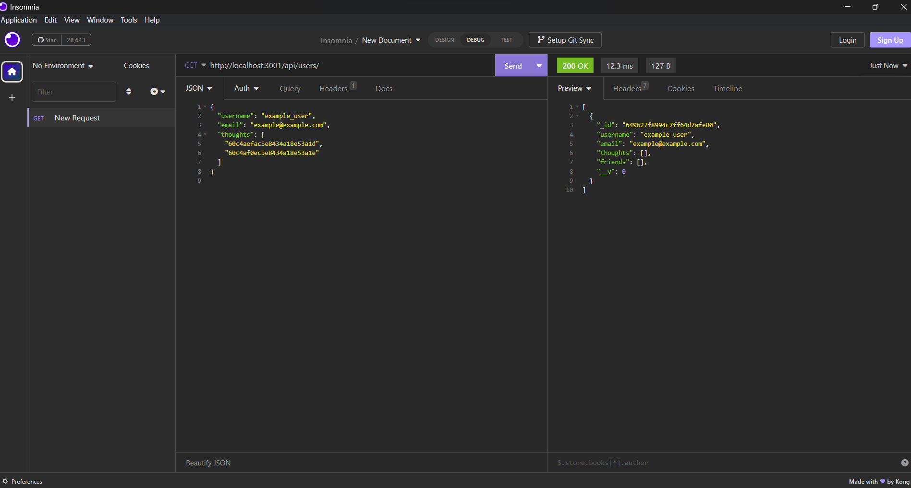

# Social Network API

  

## Description

  Backend application for CRUD operations using NoSQL requested by a social media platform. This application allows you make POST, GET, DELTE, AND PUT requests. Link to insomnia demonstration is [here](https://drive.google.com/file/d/12aRWyNAy-J9tnPVTlusMUnpeRktJXy6f/view?usp=sharing).

## Table of Contents

- [Installation](#installation)
- [Usage](#usage)
- [Contributing](#contributing)
- [Tests](#tests)
- [License](#license)
- [Questions](#questions)

## Installation

  Install necessary packages and run the server.

## Usage

  Used to make CRUD operations.

## License

This project is licensed under the terms of the [MIT license](https://opensource.org/licenses/MIT).
    

## Questions

  If you have any questions, concerns, or comments please reachout to me on [Github](https://github.com/j-sniff or at jacobsniff18@gmail.com).
